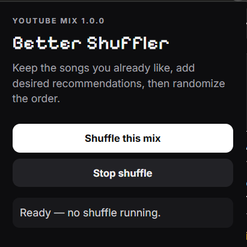
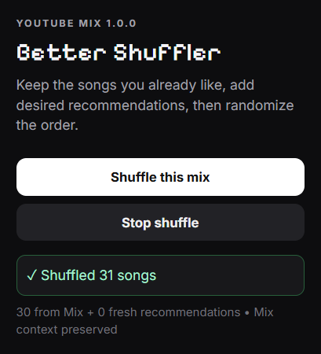

# YouTube Mix Shuffler v1.2

A Chrome MV3 extension that creates a one-pass shuffled queue from the current YouTube Mix (which sucks without us).

  

## v1.0.0 includes:

- Strict queue order: YouTube cannot replace the next queued song with its own autoplay choice.
- Each queued video ID appears only once per shuffle cycle.
- The queue index is advanced only by the extension, never by the current URL.
- Popup reports the real queue size and current position.

## Install

1. Open `chrome://extensions/`.
2. Enable **Developer mode**.
3. Click **Load unpacked**.
4. Select this folder.
5. Open a YouTube watch page containing a Mix.
6. Click **Shuffle this mix**.

After updating an existing installation, click **Reload** for the extension and refresh the YouTube tab.

## Built With

## Screenshots

  

  

## License

This project is licensed under the MIT License.
See the `LICENSE` file for details.
